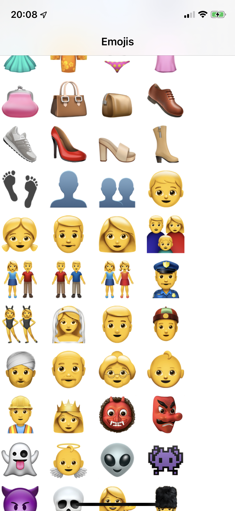

# 🥳 😍 ❤️ ✅ 😜 👽 😈 🫀 👀 💍 🧤 💅 🙉 🐦 🦋 🐝 🪰 🌹 🍔 🍿 🚘

# Emojis

This little **SwiftUI** project has the following features:

- view all the Emojis of the Unicode standard
- switch between different Unicode versions
- automatically update the items per row when adjusting the dynamic type
- using state of the art iOS 14 SwiftUI technology `LazyVGrid` and `@ScalableMetric`
- directly load emojiiis from https://unicode.org
- using combine, specifically a `dataTaskPublisher`, for requesting the unicode specification

